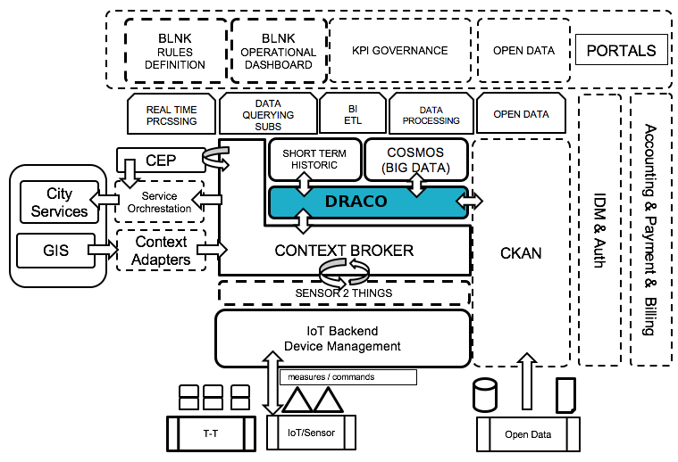

# FIWARE Draco

 

 

Draco is a is an easy to use, powerful, and reliable system to process and distribute data. Internally, Draco is based on [Apache NiFi](https://nifi.apache.org/docs.html),
NiFi is a dataflow system based on the concepts of flow-based programming. It supports powerful and scalable directed graphs of data routing, transformation, and system mediation logic.
It was built to automate the flow of data between systems. While the term 'dataflow' is used in a variety of contexts, we use it here to mean the automated and managed flow of information between systems.

This project is part of [FIWARE](https://www.fiware.org/). For more information
check the FIWARE Catalogue entry for
[Core Context Management](https://github.com/Fiware/catalogue/tree/master/core).

|  :books: [Documentation](https://fiware-draco.rtfd.io) | :whale: [Docker Hub](https://hub.docker.com/r/ging/fiware-draco) | 
|---|---|

### Terminology

In order to talk about Draco, there are a few key terms that readers should be familiar with. We will explain those NiFi-specific terms here, at a high level.

**FlowFile:** Each piece of "User Data" (i.e., data that the user brings into NiFi for processing and distribution) is referred to as a FlowFile. A FlowFile is made up of two parts: Attributes and Content. The Content is the User Data itself. Attributes are key-value pairs that are associated with the User Data.

**Processor:** The Processor is the NiFi component that is responsible for creating, sending, receiving, transforming, routing, splitting, merging, and processing FlowFiles. It is the most important building block available to NiFi users to build their dataflows.

Draco is designed to run specific set of processors and templates for 
persistence context data to multiple sinks.

Current stable release is able to persist the following sources of data in the following third-party storages:

* NGSI-like context data in:
    * [MySQL](https://www.mysql.com/), the well-known relational database manager.
    * [MongoDB](https://www.mongodb.org/), the NoSQL document-oriented database.
    * [PostgreSQL](http://www.postgresql.org/), the well-known relational database manager.

## Draco place in FIWARE architecture
Draco plays the role of a connector between Orion Context Broker (which is a NGSI source of data) and many external and FIWARE storages like MySQL, MongoDB

## Further documentation
The **Quick Start Guide** is found at readthedocs.org provides a good documentation summary ([Draco](https://fiware-draco.readthedocs.io/en/latest/quick_start_guide/index.html)).

Nevertheless, both the **Installation and Administration Guide** also found at [readthedocs.org](https://fiware-draco.readthedocs.io/en/latest/) cover more advanced topics.

The **Processors Catalogue** completes the available documentation for Draco ([Draco](https://fiware-draco.readthedocs.io/en/latest/processors_catalogue/introduction/index.html)).

## Licensing
Draco Except as otherwise noted this software is licensed under the Apache License, Version 2.0
       
       Licensed under the Apache License, Version 2.0 (the "License"); you may not use this file except in compliance with the License. You may obtain a copy of the License at
       
       http://www.apache.org/licenses/LICENSE-2.0
       
       Unless required by applicable law or agreed to in writing, software distributed under the License is distributed on an "AS IS" BASIS, WITHOUT WARRANTIES OR CONDITIONS OF ANY KIND, either express or implied. See the License for the specific language governing permissions and limitations under the License.

## Reporting issues and contact information
Any doubt you may have, please refer to the [Draco Core Team](doc/installation_and_administration_guide/issues_and_contact.md).
