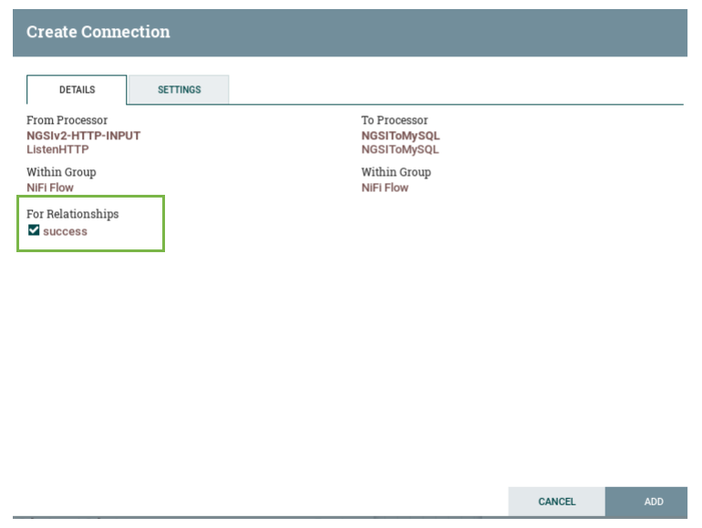
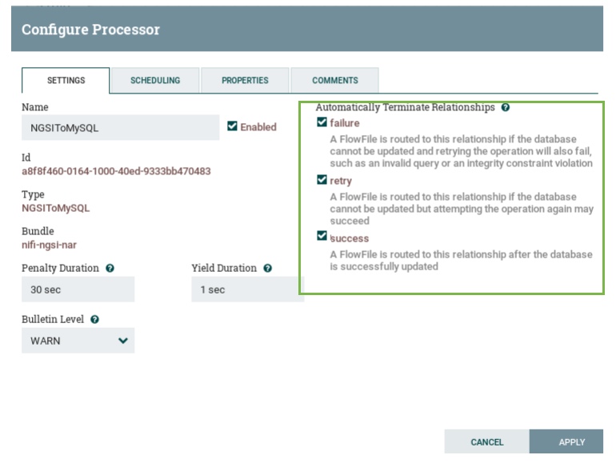
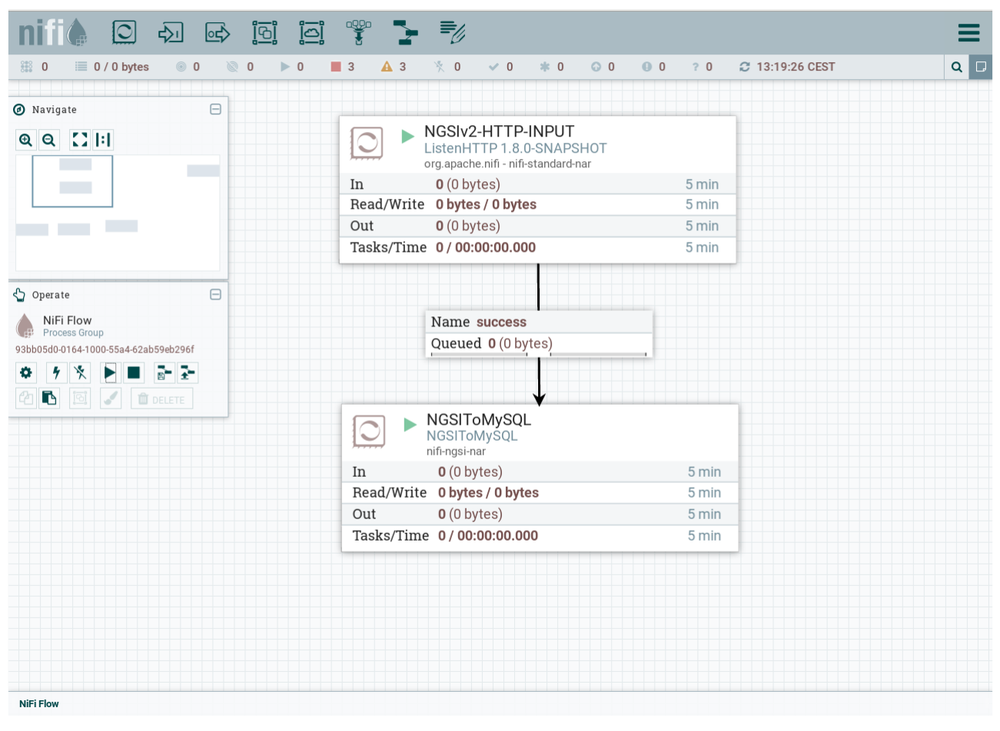

## Connecting processors

In the previous sections we explained how to configure the controllers and processors. Now we have to connect the source
processor (Listen HTTP processor) and the sinks ( NGSIToMySQL, NGSIToPostgreSQL, NGSIToMongo ).

In the [Draco GUI](./draco_gui.md) section we explain the concept of connection and how you can connect the processor
between them. Please follow the steps for connecting the Listen HTTP and NGSIToMySQL processors.

Once you connect those two processors a popup window will be displayed show that the processors are connected between
them by a success relationship because the Listen HTTP processor only has the success relationship.

However, the others NGSI processors (NGSIToMySQL, NGSIToPostgreSQL, NGSIToMongo) have at least three relationships:
success, failure, and retry. If you are not going to use those relationships for connecting with any other processors,
please set them to auto-terminate.

That is all you need to set up before starting the processors and receiving data.

Now you can start your processors by selecting them and clicking on the Play button located in the Operate pallet. At
the end, you should have a similar deployment like the next figure.

_Note_: If you want to save some time avoiding some part of the configuration process you can use the templates provided
with this Draco distribution. For more information, please go to the [Templates](./templates-draco.md) Section. Also you
can set and test your deployment following the [Quick Start Guide](../quick_start_guide.md)

Moreover, for specific information about all the properties and database structures please go to the
[Processors Catalogue Section](../processors_catalogue/README.md).
