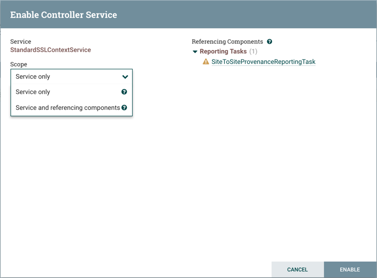
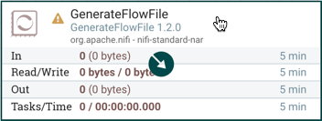
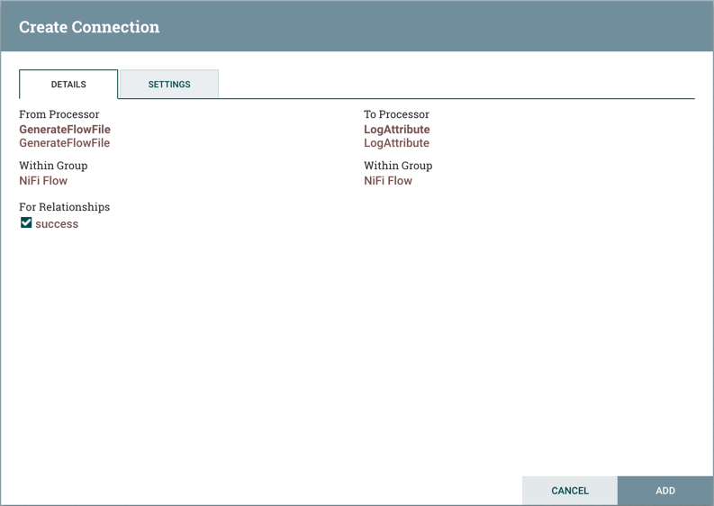

## Draco User Interface

Once you have your Draco instance installed and running, you can access to  the
user interface usually running at 8080 port (http://localhost:8080/nifi) and identify his principal components.

The next image provides you the location of many components of Draco. Please put special 
attention to the template button, play button and processor component, you will use them later.

There are no permissions configured by default, so anyone is able to view and modify the dataflow. 
For information on securing the system, see the System Administrator’s Guide.

The [NiFi official documentation](https://nifi.apache.org/docs/nifi-docs/html/user-guide.html#introduction)
provides a full detailed description
of each component of the user interface so, for avoiding duplication, we only describe the most relevant tools for using Draco with the FIWARE ecosystem.

### Adding Components to the Canvas

The User Interface section above outlined the different segments of the UI and pointed out a Components Toolbar. This section looks at each of the Components in that toolbar:
Components

###  Processor: 
The Processor is the most commonly used component, as it is responsible for data ingress, egress, routing, and manipulating. There are many different types of Processors. In fact, this is a very common Extension Point in NiFi, meaning that many vendors may implement their own Processors to perform whatever functions are necessary for their use case. When a Processor is dragged onto the canvas, the user is presented with a dialog to choose which type of Processor to use:
Add Processor Dialog.

Here you can start to find some of the FIWARE processors built for managing
NGSI events and store the data in different sinks. You only
need to write in the filter field the keyword FIWARE or NGSI and the list of
FIWARE processors will be displayed.

### Controllers:

To add a Controller Service for a dataflow, you can either do right click in any place of the Draco User space and select Configure, or click Configure from the Operate Palette.

Use the following steps to add a Controller Service:

1. Click Configure, either from the Operate Palette, or from any place of the Draco User space. This displays the process group Configuration window. The window has two tabs: General and Controller Services.  

2. From the Controller Configuration page, select the Controller Services tab.

3. Click the "+" button to display the Add Controller Service dialog.

4. Select the Controller Service desired, and click Add.

5. Perform any necessary Controller Service configuration tasks by clicking the Configure icon (

) in the right-hand column.

#### Enabling/Disabling Controller Services

After a Controller Service has been configured, it must be enabled in order to run. Do this using the Enable button 
(
) in the far-right column of the Controller Services tab. In order to modify an existing/running controller service, the DFM needs to stop/disable it (as well as all referencing reporting tasks and controller services). Do this using the Disable button (

). Rather than having to hunt down each component that is referenced by that controller service, the DFM has the ability to stop/disable them when disabling the controller service in question. When enabling a controller service, the DFM has the option to either start/enable the controller service and all referencing components or start/enable only the controller service itself.

### Connecting Components

Once processors and other components have been added to the canvas and configured, the next step is to connect them to one another so that NiFi knows what to do with each FlowFile after it has been processed. This is accomplished by creating a Connection between each component. When the user hovers the mouse over the center of a component, a new Connection icon (  ) appears:

The user drags the Connection bubble from one component to another until the second component is highlighted. When the user releases the mouse, a 'Create Connection' dialog appears. This dialog consists of two tabs: 'Details' and 'Settings'. They are discussed in detail below. Note that it is possible to draw a connection so that it loops back on the same processor. This can be useful if the DFM wants the processor to try to re-process FlowFiles if they go down a failure Relationship. To create this type of looping connection, simply drag the connection bubble away and then back to the same processor until it is highlighted. Then release the mouse and the same 'Create Connection' dialog appears.
Details Tab

The Details Tab of the 'Create Connection' dialog provides information about the source and destination components, including the component name, the component type, and the Process Group in which the component lives:

Additionally, this tab provides the ability to choose which Relationships should be included in this Connection. At least one Relationship must be selected. If only one Relationship is available, it is automatically selected.

With these basic instructions, you can add processors and controllers for managing context information using Draco. The next sections
will provide you specific information about Controllers and Processors configuration.
