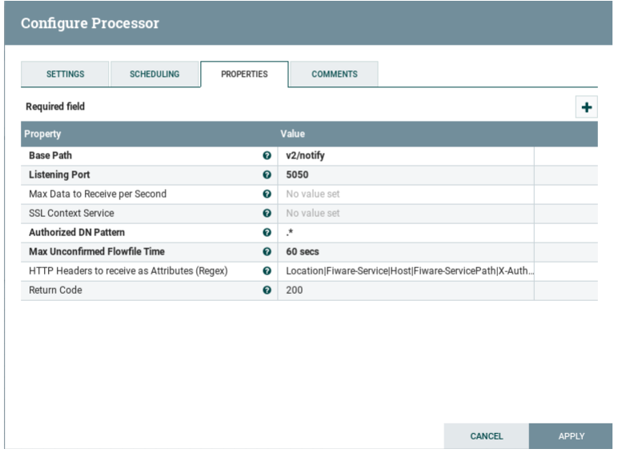
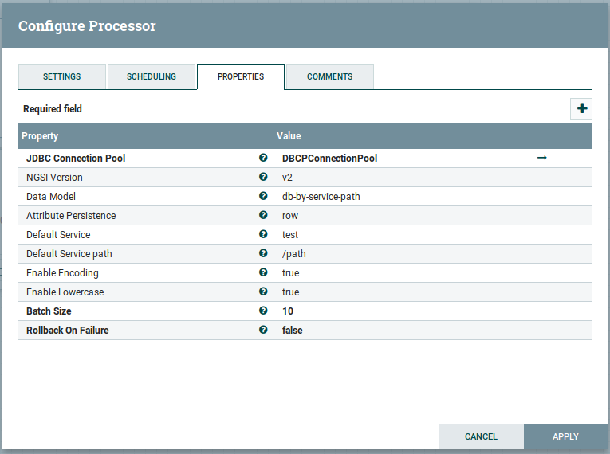
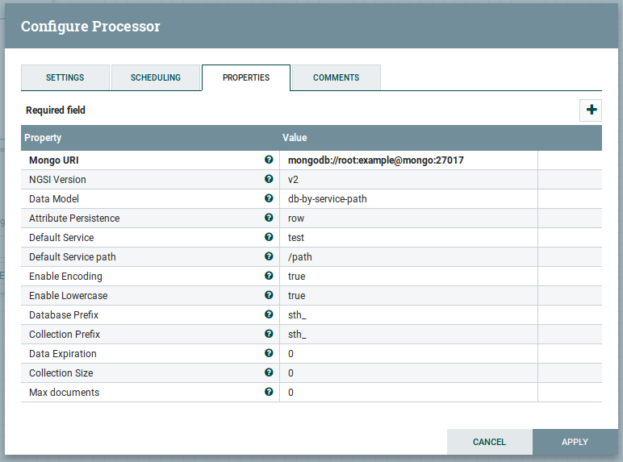

## Processors Configuration

Draco contains a set of processors for storing context data like NGSI events. 
This document is intended to show, how to configure the NGSI processor listed 
above:

* Listen_HTTP (configured as source for receiving notifications from Orion Context Broker)
* NGSIToMySQL (for storing NGSI events into MySQL Database)
* NGSIToPostgreSQL (for storing NGSI events into PostgreSQL Database)
* NGSIToMongo (for storing NGSI events into Mongo Database)

### Listen_HTTP Processor

Fist, we need to have Draco up and running. Then you need to follow the 
steps to add a new processor showed in the [Draco GUI](../installation_and_administration_guide/Draco_gui.md) section.

Once you are in the add processor window, write inside of the filter box "Http" 
in order to filter the processors by that keyword and select the "ListenHTTP" processor.

The Listen HTTP processor starts an HTTP Server and listens on a given base path to transform incoming requests into FlowFiles. The default URI of the Service will be http://{hostname}:{port}/v2/notify. Only HEAD and POST requests are supported. GET, PUT, and DELETE will result in an error and the HTTP response status code 405.
We use this NiFi native processor for receiving the HTTP notifications coming from Orion Context Broker.

The configuration needed for this processor is showed in the figure above.

Where:

|Name|Default Value|Allowable Values|Description|
|--- |--- |--- |--- |
|Base Path|contentListener| |Base path for incoming connections. This property has to match with the notify attribute of the subscription made in ORION.  Expression Language: true (will be evaluated using variable registry only)|
|Listening Port| | |The port to listen on for incoming connections. This value needs to be included in the subscription. Expression Language: true (will be evaluated using variable registry only)|
|Max Data to Receive per Second| | |The maximum amount of data to receive per second; this allows the bandwidth to be throttled to a specified data rate; if not specified, the data rate is not throttled|
|SSL Context Service| | |Controller Service API: RestrictedSSLContextServiceImplementation: StandardRestrictedSSLContextService|The Controller Service to use in order to obtain an SSL Context|
|Authorized DN Pattern|.*| |A Regular Expression to apply against the Distinguished Name of incoming connections. If the Pattern does not match the DN, the connection will be refused.|
|Max Unconfirmed Flowfile Time|60 secs| |The maximum amount of time to wait for a FlowFile to be confirmed before it is removed from the cache|
|HTTP Headers to receive as Attributes (Regex)| | |Specifies the Regular Expression that determines the names of HTTP Headers that should be passed along as FlowFile attributes. You can capture all the headers by setting to .* otherwise you have to include at least Fiware-service, Fiware-ServicePath and Optionally X-Auth-Token|
|Return Code|200| |The HTTP return code returned after every HTTP call|

### NGSIToMySQL Processor
 The NGSIToMySQL processor takes the FLowFile generated by the ListenHTTP processor and transforms it into an NGSI event. After, this processor is going to communicate with the DBCPConnectionPoll controller service (previously set in the processor's properties). Finally, the processor, using the controller features, creates the database, the tables and insert the data into the MySQL database using the structure defined by the NGSI standard.
 

|Name|Default Value|Allowable Values|Description|
|--- |--- |--- |--- |
|JDBC Connection Pool| | |Controller service for connecting to a specific database engine|
|NGSI version| v2| |List of supported versions of NGSI (v2 and ld), currently only support v2|
|Data Model| db-by-entity | |The data model for creating the tables when an event have been received you can choose between: db-by-service-path or db-by-entity, default value is db-by-service-path|
|Attribute persistence| row | row, column | The mode of storing the data inside of the table|
|Default Service|test| |In case you dont set the Fiware-Service header in the context broker, this value will be used as Fiware-Service 
|Default Service path|/path| |In case you dont set the Fiware-ServicePath header in the context broker, this value will be used as Fiware-ServicePath |
|Enable encoding| true | true, false | True applies the new encoding, false applies the old encoding.|
|Enable lowercase|true| true, false |True for creating the Schema and Tables name with lowercase.|
|Batch size| | |The preferred number of FlowFiles to put to the database in a single transaction|
|Rollback on failure |false | true, false|Specify how to handle error. By default (false), if an error occurs while processing a FlowFile, the FlowFile will be routed to 'failure' or 'retry' relationship based on error type, and processor can continue with next FlowFile. Instead, you may want to rollback currently processed FlowFiles and stop further processing immediately. In that case, you can do so by enabling this 'Rollback On Failure' property. If enabled, failed FlowFiles will stay in the input relationship without penalizing it and being processed repeatedly until it gets processed successfully or removed by other means. It is important to set adequate 'Yield Duration' to avoid retrying too frequently.|

### NGSIToPostgreSQL Processor

The NGSIToPostgreSQL processor takes the FLowFile generated by the ListenHTTP processor and transforms it into an NGSI event. After, this processor is going to communicate with the DBCPConnectionPoll controller service (previously set in the processor's properties). Finally, the processor, using the controller features, creates the database, the tables and insert the data into the PostgreSQL database using the structure defined by the NGSI standard.
 

|Name|Default Value|Allowable Values|Description|
|--- |--- |--- |--- |
|JDBC Connection Pool| | |Controller service for connecting to a specific database engine|
|NGSI version| v2| |List of supported versions of NGSI (v2 and ld), currently only support v2|
|Data Model| db-by-entity | |The data model for creating the tables when an event have been received you can choose between: db-by-service-path or db-by-entity, default value is db-by-service-path|
|Attribute persistence| row | row, column | The mode of storing the data inside of the table|
|Default Service|test| |In case you dont set the Fiware-Service header in the context broker, this value will be used as Fiware-Service 
|Default Service path|/path| |In case you dont set the Fiware-ServicePath header in the context broker, this value will be used as Fiware-ServicePath |
|Enable encoding| true | true, false | True applies the new encoding, false applies the old encoding.|
|Enable lowercase|true| true, false |True for creating the Schema and Tables name with lowercase.|
|Batch size| | |The preferred number of FlowFiles to put to the database in a single transaction|
|Rollback on failure |false | true, false|Specify how to handle error. By default (false), if an error occurs while processing a FlowFile, the FlowFile will be routed to 'failure' or 'retry' relationship based on error type, and processor can continue with next FlowFile. Instead, you may want to rollback currently processed FlowFiles and stop further processing immediately. In that case, you can do so by enabling this 'Rollback On Failure' property. If enabled, failed FlowFiles will stay in the input relationship without penalizing it and being processed repeatedly until it gets processed successfully or removed by other means. It is important to set adequate 'Yield Duration' to avoid retrying too frequently.|

### NGSIToMongo Processor

 The NGSIToMongo processor takes the FLowFile generated by the ListenHTTP processor and transforms it into an NGSI event. Finally, the processor, creates the schema, documents and collections with the data into the Mongo database using the structure defined by the NGSI standard.

|Name|Default Value|Allowable Values|Description|
|---|---|---|---|
| Mongo URI | no | localhost:27017 | FQDN/IP:port where the MongoDB server runs (standalone case) or comma-separated list of FQDN/IP:port pairs where the MongoDB replica set members run. |
| Mongo username | no | <i>empty</i> | If empty, no authentication is done. |
| Mongo password | no | <i>empty</i> | If empty, no authentication is done. |
| NGSI version| v2| |List of supported version of NGSI (v2 and ld), currently only support v2|
| Data Model| db-by-entity | |The data model for creating the tables when an event have been received you can choose between: db-by-service-path or db-by-entity, default value is db-by-service-path|
| Attribute persistence| row | row, column | The mode of storing the data inside of the table|
|Default Service|test| |In case you dont set the Fiware-Service header in the context broker, this value will be used as Fiware-Service 
|Default Service path|/path| |In case you dont set the Fiware-ServicePath header in the context broker, this value will be used as Fiware-ServicePath |
| Enable encoding| true | true, false | True applies the new encoding, false applies the old encoding.|
| Enable lowercase|true| true, false | True for creating the Schema and Tables name with lowercase.|
| Database prefix | sth_ |  ||
| Collection prefix | sth_ |  | `system.` is not accepted. |
| Data Expiration | 0 |  | Collections will be removed if older than the value specified in seconds. The reference of time is the one stored in the `recvTime` property. Set to 0 if not wanting this policy. |
| Collections Size | 0 |  | The oldest data (according to insertion time) will be removed if the size of the data collection gets bigger than the value specified in bytes. Notice that the size-based truncation policy takes precedence over the time-based one. Set to 0 if not wanting this policy. Minimum value (different than 0) is 4096 bytes. |
| Max Documents | 0 |  | The oldest data (according to insertion time) will be removed if the number of documents in the data collections goes beyond the specified value. Set to 0 if not wanting this policy. |
| Write Concern| ACKNOWLEDGED | |The write concern to use|

Once you have your processors configured, you need to connect the source (Listen HTTP processor) and the sinks (NGSIToMySQL, NGSIToPostgreSQL, NGSIToMongo ). In the next section we will explain how to establish and configure this connection.
